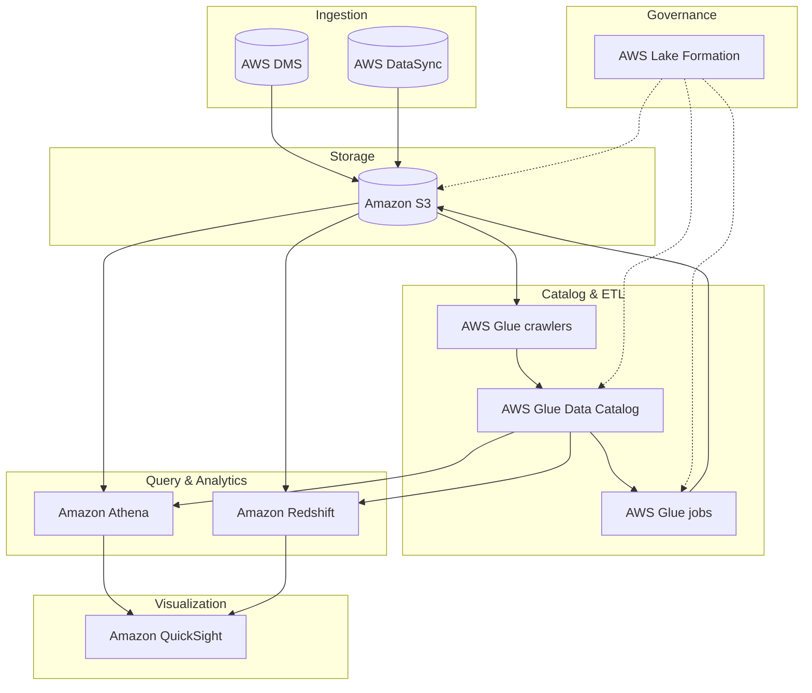

## Construindo uma Solucao de Data Lake

Tudo inicia com reuniões de levantamento de informações detalhadas com os consumidores de dados e partes interessadas relevantes, 
a equipe de engenharia de dados sugeriu a criação de uma arquitetura de data lake na AWS com os seguintes componentes:

  * O Amazon Simple Storage Service (Amazon S3)  serve como base e principal armazenamento do data lake. 
  * O AWS Database Migration Service (AWS DMS) serve para conectar-se aos bancos de dados locais e ingerir os dados no data lake.
  * O AWS DataSync é usado para replicar dados de sistemas de armazenamento conectados à rede (NAS) locais para o Amazon S3.
  * Os crawlers do AWS Glue são usados ​​para rastrear os dados no Amazon S3 e, em seguida, armazenar os metadados descobertos (como definições de tabelas e esquemas) no Catálogo de Dados do AWS Glue .

Após a catalogação dos dados, os trabalhos do AWS Glue podem ser usados ​​para transformar, enriquecer e carregar os dados nos buckets ou zonas S3 apropriados. 

  * O AWS Lake Formation oferece governança unificada para gerenciar centralmente a segurança de dados, o controle de acesso e as trilhas de auditoria.
  * O Amazon Redshift  como seu data warehouse para executar consultas SQL complexas e de baixa latência em seus dados estruturados.
  * O Amazon Athena para realizar consultas pontuais ou sob demanda diretamente no Amazon S3.
  * O Amazon QuickSight  para painéis de business intelligence e visualização de dados.

Com um data lake na AWS, conseguimos maximizar o valor de seus dados, otimizando ao mesmo tempo a segurança, os custos e a eficiência operacional.

---

### Tarefas típicas na construção de um data lake na AWS

