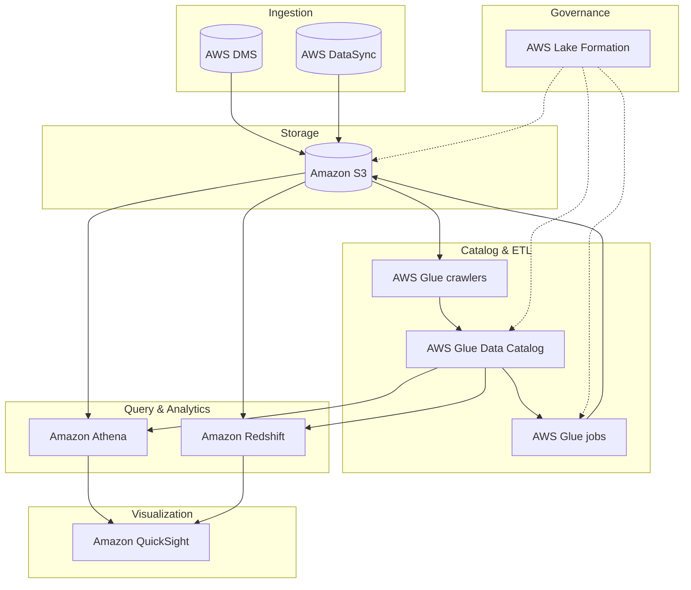

## Construindo uma Solucao de Data Lake

---

Tudo inicia com reuniões de levantamento de informações detalhadas com os consumidores de dados e partes interessadas relevantes.

#### 1. Alignment with Business Goals: Converting organizational aspirations into tangible technical implementations, ensuring that all cloud adoption has a clear purpose. This is the ignition point of Wave 1. The Business Architect Agent uses LLMs in OCI Generative AI to conduct interactive interviews with stakeholders. It captures these aspirations and automatically generates the Cloud Adoption Vision Statement, tying the strategy to the KPIs before provisioning any resources.

| Theme | Subtopic | Module | Objective |
|:---|:---|:---|:---|
| Alignment with Business Goals	| Alignment with Business Goals	| Define Business Goals	| The conversion of business aspirations into tangible technical implementations within the context of cloud adoption and migration is a multifaceted effort based in business architecture | 
| Alignment with Business Goals	| Alignment with Business Goals	| Systematic evaluation and transition | The process of translating business objectives into technical solutions during cloud adoption and migration involves detailed assessment of existing systems and applications. This assessment determines which elements can be migrated into the cloud and which demand the integration of novel cloud-centric solutions. During transition, consider security, performance, and harmonization with pre-existing systems. | 
| Alignment with Business Goals	| Alignment with Business Goals	| Seamless integration | When suitable cloud-driven solutions are identified, their assimilation into your existing technological framework is the primary goal. Perform the integration in a way that reinforces the pursuit of your business goals. Achieving this integration might include the tailoring of cloud-based solutions to accommodate specific needs of your organization, combined with their seamless integration into established systems and applications. | 
| Alignment with Business Goals	| Alignment with Business Goals	| Risk mitigation and compliance adherence | During cloud adoption, migration, and the process of transforming business objectives into technical realities, you must consider risk management and regulatory compliance. This involves identifying and assessing potential vulnerabilities linked with cloud-based solutions, and forming strategies to mitigate the vulnerabilities. Design cloud-based solutions thoroughly to align with required regulations and standards. Build a strong framework of controls to safeguard ongoing compliance. | 

A equipe de engenharia de dados sugeriu a criação de uma arquitetura de data lake na AWS com os seguintes componentes:

  * O Amazon Simple Storage Service (Amazon S3)  serve como base e principal armazenamento do data lake. 
  * O AWS Database Migration Service (AWS DMS) serve para conectar-se aos bancos de dados locais e ingerir os dados no data lake.
  * O AWS DataSync é usado para replicar dados de sistemas de armazenamento conectados à rede (NAS) locais para o Amazon S3.
  * Os crawlers do AWS Glue são usados ​​para rastrear os dados no Amazon S3 e, em seguida, armazenar os metadados descobertos (como definições de tabelas e esquemas) no Catálogo de Dados do AWS Glue .

Após a catalogação dos dados, os trabalhos do AWS Glue podem ser usados ​​para transformar, enriquecer e carregar os dados nos buckets ou zonas S3 apropriados. 

  * O AWS Lake Formation oferece governança unificada para gerenciar centralmente a segurança de dados, o controle de acesso e as trilhas de auditoria.
  * O Amazon Redshift  como seu data warehouse para executar consultas SQL complexas e de baixa latência em seus dados estruturados.
  * O Amazon Athena para realizar consultas pontuais ou sob demanda diretamente no Amazon S3.
  * O Amazon QuickSight  para painéis de business intelligence e visualização de dados.

Com um data lake na AWS, conseguimos maximizar o valor de seus dados, otimizando ao mesmo tempo a segurança, os custos e a eficiência operacional.

---

### Tarefas típicas na construção de um data lake na AWS

#### Tarefa 1: Configurar o armazenamento
O Amazon Simple Storage Service (Amazon S3) serve como base e principal armazenamento do data lake.

#### Tarefa 2: Ingerir dados
O AWS Database Migration Service (AWS DMS) é usado para conectar-se a bancos de dados locais e ingerir os dados no data lake do Amazon S3.
O AWS DataSync é usado para replicar dados de um armazenamento conectado à rede (NAS) local para o Amazon S3.

#### Tarefa 3: Criar registro de dados
Os crawlers do AWS Glue são usados ​​para rastrear os dados no Amazon S3 e, em seguida, armazenar os metadados descobertos (como definições de tabelas e esquemas) no Catálogo de Dados do AWS Glue.

#### Tarefa 4: Processar dados
Após a catalogação dos dados, os trabalhos do AWS Glue podem ser usados ​​para transformar, enriquecer e carregar os dados nos buckets ou zonas S3 apropriados.

#### Tarefa 5: Configurar a segurança
O AWS Lake Formation oferece governança unificada para gerenciar centralmente a segurança de dados, o controle de acesso e as trilhas de auditoria.

#### Tarefa 6: Disponibilizar dados para consumo
O Amazon Redshift  serve como data warehouse para executar consultas SQL complexas e de baixa latência em dados estruturados.
O Amazon Athena é usado para realizar consultas pontuais ou improvisadas.
O Amazon QuickSight é usado para painéis de inteligência de negócios e visualização de dados.

*Não existem duas iniciativas de data lake idênticas. Cada uma é projetada para atender a objetivos e requisitos organizacionais específicos. Este curso apresenta uma solução básica de data lake e opções de configuração a serem consideradas para seus próprios projetos.*

---

### Benefícios dos data lakes da AWS

Um data lake é uma abordagem arquitetônica que permite armazenar todos os seus dados em um repositório centralizado. 
Esses dados podem então ser acessados, transformados e analisados ​​pelo conjunto apropriado de usuários e ferramentas. 
É essencial ser estratégico na gestão dos seus dados e garantir que as medidas de qualidade, governança e segurança estejam em vigor.

#### Escalabilidade:
Ao armazenar grandes volumes e variedades de conjuntos de dados em conjunto, uma solução de data lake da AWS ajuda você a gerar insights orientados por dados usando as ferramentas apropriadas para cada tarefa.

#### Capacidade de descoberta:
Os data lakes permitem descobrir quais dados estão armazenados por meio de rastreamento, catalogação e indexação. Eles também garantem a proteção de todos os seus ativos de dados.

#### A capacidade de compartilhamento
dos Data Lakes permite que diversas funções, como cientistas de dados, desenvolvedores de dados e analistas de negócios, acessem os dados com as ferramentas de análise e aprendizado de máquina (ML) de sua escolha.

#### Agilidade:
Com as opções sem servidor mais avançadas na nuvem, a AWS ajuda a reduzir o trabalho pesado e repetitivo de provisionamento e gerenciamento de infraestrutura.

---

