## Construindo uma Solucao de Data Lake

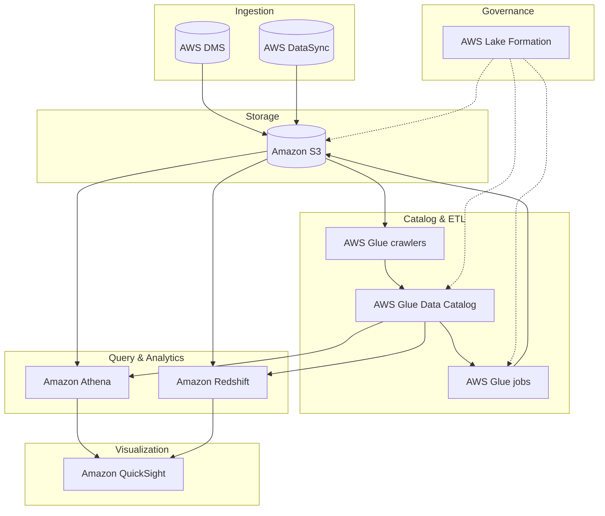

---

Tudo inicia com reuniões de levantamento de informações detalhadas com os consumidores de dados e partes interessadas relevantes.

Essas conversas capturam as necessidades analíticas, restrições de acesso, requisitos de conformidade e aspirações organizacionais. 
A partir desse levantamento, o AWS Lake Formation é utilizado para traduzir esses requisitos em implementações técnicas tangíveis de governança de dados — como políticas de permissão granulares, catalogação centralizada e auditoria de acesso

| Tema | Subtópico | Módulo | Objetivo |
|:---|:---|:---|:---|
| Alinhamento com os Objetivos de Negócios | Alinhamento com os Objetivos de Negócios | Definir metas de negócios para governança de dados | A conversão de aspirações de negócios em implementações técnicas tangíveis começa com reuniões estruturadas de levantamento com consumidores de dados e stakeholders. O AWS Lake Formation, então, materializa essas diretrizes em um catálogo de dados seguro e políticas de acesso alinhadas aos objetivos de negócio. |
| Alinhamento com os Objetivos de Negócios | Alinhamento com os Objetivos de Negócios | Avaliação sistemática e transição de fontes de dados | Após o levantamento detalhado com as partes interessadas, o processo de tradução de objetivos em soluções técnicas envolve avaliar quais fontes de dados (S3, RDS, etc.) devem ser registradas no Lake Formation, quais transformações serão necessárias (via AWS Glue) e como as necessidades de consumo (quem, o quê, quando) informam a criação de zonas de dados e permissões. |
| Alinhamento com os Objetivos de Negócios | Alinhamento com os Objetivos de Negócios | Integração perfeita com o ecossistema analítico | Com base nos requisitos levantados (ex.: consumidores precisam de acesso a tabelas específicas, com filtros por linha/coluna), o Lake Formation permite a integração perfeita dessas políticas ao ecossistema analítico (Athena, EMR, Redshift, QuickSight). O objetivo é que os dados certos estejam disponíveis para os consumidores certos, exatamente como definido nas reuniões iniciais. |
| Alinhamento com os Objetivos de Negócios | Alinhamento com os Objetivos de Negócios | Mitigação de riscos e adesão à conformidade | Durante as reuniões de levantamento, identificam-se vulnerabilidades (dados sensíveis, requisitos da LGPD, etc.) e expectativas de conformidade. O Lake Formation é então configurado para mitigar esses riscos por meio de políticas centralizadas, criptografia (integrada com KMS) e auditoria via CloudTrail. A estrutura de controles reflete diretamente as decisões tomadas com os consumidores de dados. |

---

A equipe de engenharia de dados sugeriu a criação de uma arquitetura de data lake na AWS com os seguintes componentes:

  * O Amazon Simple Storage Service (Amazon S3)  serve como base e principal armazenamento do data lake. 
  * O AWS Database Migration Service (AWS DMS) serve para conectar-se aos bancos de dados locais e ingerir os dados no data lake.
  * O AWS DataSync é usado para replicar dados de sistemas de armazenamento conectados à rede (NAS) locais para o Amazon S3.
  * Os crawlers do AWS Glue são usados ​​para rastrear os dados no Amazon S3 e, em seguida, armazenar os metadados descobertos (como definições de tabelas e esquemas) no Catálogo de Dados do AWS Glue .

Após a catalogação dos dados, os trabalhos do AWS Glue podem ser usados ​​para transformar, enriquecer e carregar os dados nos buckets ou zonas S3 apropriados. 

  * O AWS Lake Formation oferece governança unificada para gerenciar centralmente a segurança de dados, o controle de acesso e as trilhas de auditoria.
  * O Amazon Redshift  como seu data warehouse para executar consultas SQL complexas e de baixa latência em seus dados estruturados.
  * O Amazon Athena para realizar consultas pontuais ou sob demanda diretamente no Amazon S3.
  * O Amazon QuickSight  para painéis de business intelligence e visualização de dados.

Com um data lake na AWS, conseguimos maximizar o valor de seus dados, otimizando ao mesmo tempo a segurança, os custos e a eficiência operacional.

---

### Tarefas típicas na construção de um data lake na AWS

#### Tarefa 1: Configurar o armazenamento
O Amazon Simple Storage Service (Amazon S3) serve como base e principal armazenamento do data lake.

#### Tarefa 2: Ingerir dados
O AWS Database Migration Service (AWS DMS) é usado para conectar-se a bancos de dados locais e ingerir os dados no data lake do Amazon S3.
O AWS DataSync é usado para replicar dados de um armazenamento conectado à rede (NAS) local para o Amazon S3.

#### Tarefa 3: Criar registro de dados
Os crawlers do AWS Glue são usados ​​para rastrear os dados no Amazon S3 e, em seguida, armazenar os metadados descobertos (como definições de tabelas e esquemas) no Catálogo de Dados do AWS Glue.

#### Tarefa 4: Processar dados
Após a catalogação dos dados, os trabalhos do AWS Glue podem ser usados ​​para transformar, enriquecer e carregar os dados nos buckets ou zonas S3 apropriados.

#### Tarefa 5: Configurar a segurança
O AWS Lake Formation oferece governança unificada para gerenciar centralmente a segurança de dados, o controle de acesso e as trilhas de auditoria.

#### Tarefa 6: Disponibilizar dados para consumo
O Amazon Redshift  serve como data warehouse para executar consultas SQL complexas e de baixa latência em dados estruturados.
O Amazon Athena é usado para realizar consultas pontuais ou improvisadas.
O Amazon QuickSight é usado para painéis de inteligência de negócios e visualização de dados.

*Não existem duas iniciativas de data lake idênticas. Cada uma é projetada para atender a objetivos e requisitos organizacionais específicos. Este curso apresenta uma solução básica de data lake e opções de configuração a serem consideradas para seus próprios projetos.*

---

### Benefícios dos data lakes da AWS

Um data lake é uma abordagem arquitetônica que permite armazenar todos os seus dados em um repositório centralizado. 
Esses dados podem então ser acessados, transformados e analisados ​​pelo conjunto apropriado de usuários e ferramentas. 
É essencial ser estratégico na gestão dos seus dados e garantir que as medidas de qualidade, governança e segurança estejam em vigor.

#### Escalabilidade:
Ao armazenar grandes volumes e variedades de conjuntos de dados em conjunto, uma solução de data lake da AWS ajuda você a gerar insights orientados por dados usando as ferramentas apropriadas para cada tarefa.

#### Capacidade de descoberta:
Os data lakes permitem descobrir quais dados estão armazenados por meio de rastreamento, catalogação e indexação. Eles também garantem a proteção de todos os seus ativos de dados.

#### A capacidade de compartilhamento
dos Data Lakes permite que diversas funções, como cientistas de dados, desenvolvedores de dados e analistas de negócios, acessem os dados com as ferramentas de análise e aprendizado de máquina (ML) de sua escolha.

#### Agilidade:
Com as opções sem servidor mais avançadas na nuvem, a AWS ajuda a reduzir o trabalho pesado e repetitivo de provisionamento e gerenciamento de infraestrutura.

---

### Configurar Armazenamento

Vamos segmentar o data lake em três buckets distintos do S3. Além disso, para atender às regulamentações do setor e otimizar custos, optaram por usar diferentes classes de armazenamento e políticas de ciclo de vida do Amazon S3.

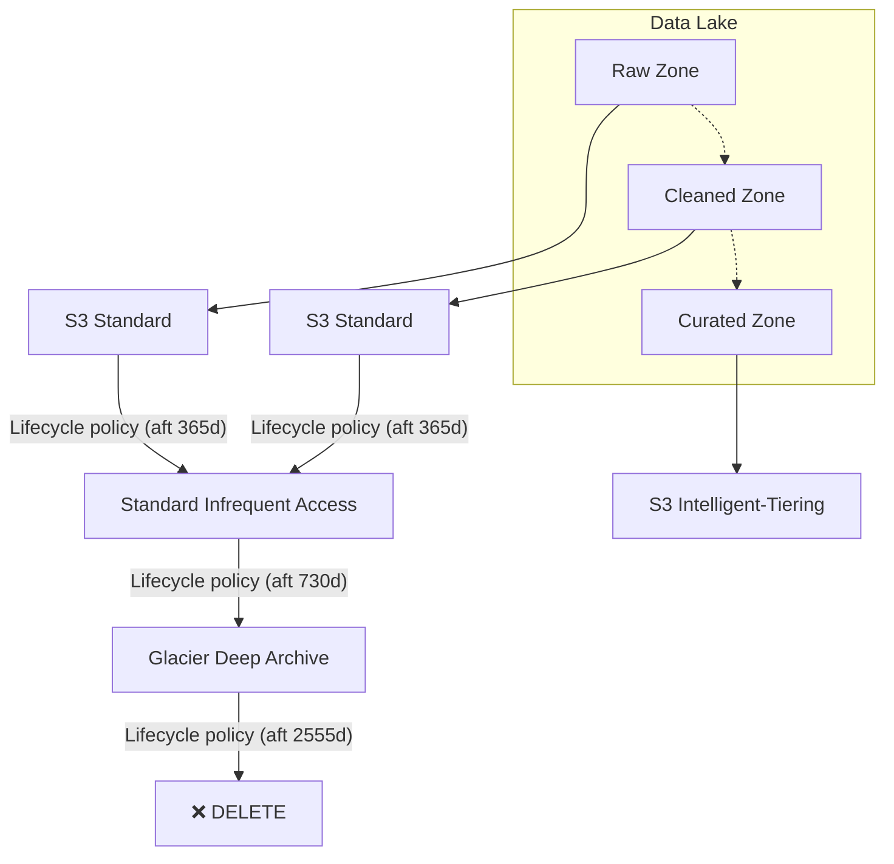

#### Passo 1

A zona de dados brutos (raw zone) é onde os dados brutos são ingeridos a partir de seus bancos de dados de origem. Esse bucket garante a integridade dos dados, pois o formato original é preservado para futuras auditorias ou necessidades de reprocessamento. 

#### Passo 2 

A zona limpa (clean zone) é onde os dados processados ​​ou transformados são armazenados. As atividades comuns de processamento de dados incluem filtrar anomalias, padronizar formatos e corrigir valores inválidos.

#### Passo 3 

A área de dados selecionados (curated zone) é onde os dados processados ​​são mesclados ou combinados com outros conjuntos de dados e disponibilizados para análises específicas e casos de uso de aprendizado de máquina.

Para cumprir as regulamentações do setor e otimizar custos, podemos utiliza diferentes classes de armazenamento S3 e políticas de ciclo de vida do Amazon S3. 
Por exemplo, optaram pela classe de armazenamento Amazon  S3 Standard tanto para as zonas de dados brutos quanto para as zonas de dados limpos, por ser adequada para cargas de trabalho com alto volume de transações.

Após a curadoria dos dados nessas duas zonas, o acesso a eles é raro. Portanto, para fins de arquivamento, foram criadas várias regras de ciclo de vida do S3 para migrar automaticamente os dados para diferentes classes de armazenamento.

  * Primeira regra:  Após 1 ano, mova todos os arquivos para a classe de armazenamento S3 Standard-Infrequent Access (S3 Standard-IA)  .
  * Segunda regra:  Após 2 anos no S3 Standard-Infrequent Access, mova-os para a classe de armazenamento S3 Glacier Deep Archive .
  * Terceira regra:  Após 7 anos na classe de armazenamento S3 Glacier Deep Archive, exclua ou deixe expirar os dados.

Para a zona curada, eles escolheram a classe S3 Intelligent-Tiering em vez das regras de ciclo de vida do S3. 
O S3 Intelligent-Tiering move automaticamente os dados para a camada de armazenamento mais econômica à medida que os dados esfriam. 
Dessa forma, eles não precisam gerenciar várias regras para os diversos consumidores de dados e casos de uso que acessam a zona curada.

---

### Amazon S3 para data lakes

O Amazon S3 oferece uma base ideal para um data lake devido à sua escalabilidade praticamente ilimitada e alta durabilidade. Ele também proporciona melhor desempenho, segurança e integração com um amplo portfólio de serviços de análise, visualização e aprendizado de máquina. 

| Recurso | Descrição |
|:---|:---|
| Escalabilidade | O Amazon S3 é um armazenamento de objetos em escala de exabytes para armazenar qualquer tipo de dado. Você pode armazenar dados estruturados (como dados relacionais), dados semiestruturados (como arquivos JSON, XML e CSV) e dados não estruturados (como imagens ou arquivos de mídia). Você pode começar com um volume pequeno e expandir seu data lake conforme necessário, sem comprometer o desempenho ou a confiabilidade. | 
| Durabilidade | O Amazon S3 foi projetado para oferecer 99,999999999% (11 noves) de durabilidade de dados. O Amazon S3 Standard cria automaticamente cópias de todos os objetos carregados e as armazena em pelo menos três Zonas de Disponibilidade. Isso significa que seus dados estão protegidos por um modelo de resiliência Multi-AZ e contra falhas no nível do site. O S3 One Zone - Acesso Infrequente (S3 One Zone-IA) cria cópias em uma única Zona de Disponibilidade. | 
| Segurança | O Amazon S3 foi projetado para fornecer segurança e conformidade incomparáveis ​​no armazenamento em nuvem em todas as classes de armazenamento, incluindo gerenciamento de identidade e acesso, verificação de inventário, criptografia automática e muito mais. | 
| Disponibilidade | As classes de armazenamento do Amazon S3 são projetadas para fornecer uma disponibilidade de objetos entre 99,5% e 99,99% em um determinado ano. Isso é garantido por alguns dos acordos de nível de serviço (SLAs) mais robustos da nuvem. | 
| Custo | O armazenamento de ativos de dados geralmente representa uma parcela significativa dos custos associados a um data lake. Ao construir um data lake no Amazon S3, você paga apenas pelos serviços de armazenamento e processamento de dados que realmente utiliza, conforme os utiliza. | 

---

### Zonas ou camadas do data lake

#### Zonas padroes

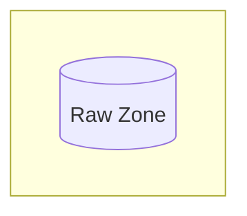

*A zona de dados brutos armazena os dados brutos conforme são inseridos no data lake. Para preservar a integridade dos dados, recomenda-se manter o formato de arquivo original e ativar o versionamento neste bucket do S3.*

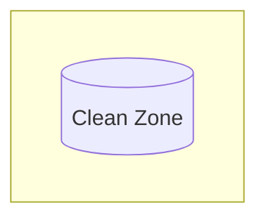

*A zona limpa armazena dados processados ​​ou transformados. Por exemplo, filtragem de anomalias, padronização de formatos e correção de valores inválidos.*

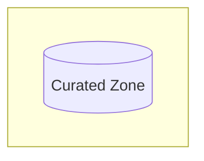

*As lojas Zone, com conteúdo selecionado, combinam, agregam e garantem a qualidade de dados para casos de uso específicos em um formato pronto para consumo.*

#### Alem desses existem alguns zonas adicionais a serem considerados.

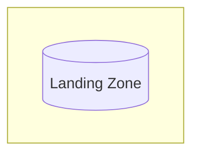

*A zona de dados brutos armazena os dados brutos conforme são inseridos no data lake. Para preservar a integridade dos dados, recomenda-se manter o formato de arquivo original e ativar o versionamento neste bucket do S3.*

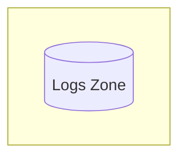

*Esta zona é usada para registros do Amazon S3 e de outros serviços na arquitetura do data lake. Os registros podem incluir registros de acesso do S3, arquivos de registro do Amazon CloudWatch ou arquivos de registro do AWS CloudTrail.*

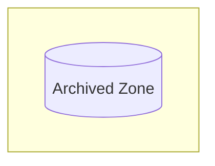

*Esta zona é utilizada para armazenar dados históricos, de acesso pouco frequente ou relacionados com a conformidade.*

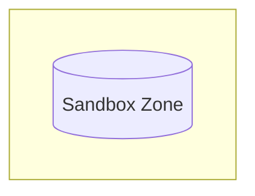

*Esta zona é utilizada para análises exploratórias e experimentação.*

---

### Classes de armazenamento Amazon S3

O Amazon S3 oferece uma variedade de classes de armazenamento projetadas para diferentes casos de uso e padrões de acesso. Escolher a classe adequada pode ajudar você a obter o melhor custo-benefício em armazenamento de objetos. 

#### Classe de armazenamento para objetos em movimento automático 
O **S3 Intelligent-Tiering** é uma classe de armazenamento que proporciona economia automática de custos para dados com padrões de acesso desconhecidos ou em constante mudança. Ele move automaticamente os dados para a camada de armazenamento mais econômica, sem impacto no desempenho ou sobrecarga operacional.

#### Classes de armazenamento para objetos acessados ​​frequentemente 

O **S3 Standard** é um armazenamento de uso geral para dados ativos e acessados ​​com frequência. 

O **S3 Express One Zone** é uma classe de armazenamento de alto desempenho, com uma única zona de disponibilidade (Single AZ), criada especificamente para fornecer a menor latência possível para seus dados acessados ​​com mais frequência. Com essa classe de armazenamento, os dados são armazenados em um tipo de bucket diferente — um bucket de diretório S3 — que suporta centenas de milhares de solicitações por segundo.

#### Classes de armazenamento para objetos acessados ​​com pouca frequência
O **S3 Standard - Acesso Infrequente (S3 Standard-IA)** é um armazenamento de baixo custo para dados acessados ​​mensalmente e que requer recuperação em milissegundos. 

O **S3 One Zone - Acesso Infrequente (S3 One Zone-IA)** é um armazenamento de baixo custo para dados acessados ​​com pouca frequência em uma Zona de Disponibilidade Única (Single-AZ). 

#### Classes de armazenamento para arquivamento de objetos

O **S3 Glacier Instant Retrieval** é o armazenamento de baixo custo para dados de longa duração, acessados ​​poucas vezes por ano e que requerem recuperação em milissegundos. 

O **S3 Glacier Flexible Retrieval** é o armazenamento de baixo custo para dados de longa duração usados ​​para backups e arquivamento, com recuperação de dados em massa em minutos ou horas. 

O **S3 Glacier Deep Archive** é o armazenamento de menor custo para dados arquivados a longo prazo, acessados ​​raramente, com recuperação em horas.

---

### Políticas de ciclo de vida S3

Você pode configurar regras de ciclo de vida do S3 para gerenciar os custos de armazenamento. Elas podem migrar automaticamente ativos de dados para um nível de armazenamento de custo inferior, como o S3 Standard-IA ou a classe de armazenamento Amazon S3 Glacier Flexible Retrieval. Também é possível configurar regras para expirar ativos quando eles não forem mais necessários.

#### Considerações sobre a política de ciclo de vida

Para ajudar você a decidir quando transferir os dados corretos para a classe de armazenamento adequada, use a Análise de Classe de Armazenamento do Amazon Analytics S3 . Após usar a análise de classe de armazenamento para monitorar os padrões de acesso, você pode usar as informações para configurar as políticas do ciclo de vida do S3 e realizar a transferência de dados para a classe de armazenamento apropriada.   

  * Se o seu bucket for versionado, certifique-se de que exista uma regra de ação para que os objetos atuais e não atuais possam ser transferidos ou expirados.
  * Se você estiver enviando objetos usando o método de upload multipart, pode haver situações em que os uploads falhem ou não sejam concluídos. Os uploads incompletos permanecem em seus buckets e são cobrados. Você pode configurar regras de ciclo de vida para limpar automaticamente os uploads multipart incompletos após um determinado período.

Para ter uma política de ciclo de vida única para todos os conjuntos de dados de origem (em vez de uma para cada prefixo de origem), você pode manter todos os dados de origem sob um único prefixo.
Os custos de transição do ciclo de vida do S3 são diretamente proporcionais ao número de objetos migrados. Reduza o número de objetos agregando-os ou compactando-os antes de movê-los para os níveis de arquivamento.

---

### Técnicas adicionais de otimização do Amazon S3

#### Utilizando a marcação de objetos S3

A marcação de objetos no S3 é usada para controlar o acesso de forma granular, analisar o uso, gerenciar políticas de ciclo de vida e replicar objetos. 

#### Avaliar sua atividade de armazenamento e estimar seus custos.

À medida que seu data lake cresce, pode se tornar cada vez mais complicado avaliar o uso dos dados em toda a sua organização, avaliar seu nível de segurança e otimizar custos. 

O Amazon S3 Storage Lens oferece visibilidade do seu armazenamento de objetos em toda a sua organização, com métricas pontuais e insights acionáveis. Ele ajuda você a visualizar tendências, identificar anomalias e receber recomendações para otimização de custos de armazenamento. Você pode gerar insights nos níveis de organização, conta, região da AWS, bucket e prefixo. Para obter mais informações, consulte S3 Storage Lens.(abre em uma nova aba).

A seguir, algumas das informações que você pode acessar no painel do S3 Storage Lens.

  * Tamanho do balde, tamanho do objeto e contagem de objetos
  * Distribuição de dados em diferentes classes de armazenamento
  * Dados não criptografados
  * Múltiplas versões de objetos
  * Envios multipartes incompletos
  * Baldes frios (que não foram acessados ​​por muito tempo)

A Calculadora de Preços da AWS é uma ferramenta de planejamento online que você pode usar para criar estimativas de custos para o uso dos serviços da AWS. Para obter mais informações, consulte a Calculadora de Preços da AWS.(abre em uma nova aba).

Você pode usar a Calculadora de Preços para os seguintes casos de uso:

  * Modele suas soluções antes de construí-las.
  * Explore os preços dos serviços da AWS.
  * Revise os cálculos das suas estimativas.
  * Planeje seus gastos com a AWS.
  * Identifique oportunidades para reduzir custos.

#### Considerando uma estratégia de conta única ou de múltiplas contas

Os seguintes fatores devem ser considerados ao decidir se deve usar uma única conta da AWS ou uma estratégia com várias contas para sua iniciativa de data lake. 

| Fator | Estratégia de conta |
|:---|:---|
| Você possui um departamento central de TI com equipes de integração de dados e segurança. |  Conta única |
| Você é uma grande organização com várias linhas de negócios (LOBs) que operam de forma independente e possuem departamentos de TI separados. | Conta múltipla |
| Você está começando com uma prova de conceito (POC) ou um produto mínimo viável (MVP) e deseja uma configuração simples. | Conta única |

*Se você ainda não se decidiu, pode começar com uma única conta da AWS e depois migrar para uma estratégia com várias contas.*

---

## Ingerir dados

Agora que configuramos os buckets do Amazon S3 (os buckets de dados brutos, limpos e curados), desejamos ingerir os dados no data lake. Então começando com três fontes de dados que desejam ingerir:

  * Um banco de dados MySQL local
  * Um banco de dados Amazon Aurora pré-existente
  * Dados localizados em um dispositivo de armazenamento conectado à rede (NAS) local.

Para importar os dois bancos de dados, será utilizado o AWS Database Migration Service (AWS DMS).

Primeiro, criamos uma instância de replicação do AWS DMS. Essa instância funciona como o recurso computacional que será usado para executar as tarefas de replicação, configuradas nas etapas subsequentes.

Em seguida, especificamos os endpoints de origem e destino. O endpoint de origem no AWS DMS refere-se ao armazenamento de dados do qual você deseja migrar os dados. O endpoint de destino refere-se ao armazenamento de dados para o qual você deseja migrar os dados.

Criamos dois pontos de extremidade de origem para extrair dados de seus dois bancos de dados de origem:

  * Uma tabela de campanhas de marketing de um banco de dados MySQL local.
  * Uma tabela de vendas de um banco de dados Amazon Aurora.

Em seguida, criamos dois endpoints de destino para carregar todos os dados no bucket da zona de dados brutos do data lake do Amazon S3: um endpoint para os dados das campanhas de marketing e outro para os dados de vendas.

Em seguida, criamos tarefas de migração de banco de dados para cada uma das fontes configuradas e especificaram os destinos correspondentes.

A primeira tarefa foi uma migração única dos dados existentes, também conhecida como migração de carga completa. 
Após a conclusão desse processo, eles empregaram a replicação contínua, também conhecida como Captura de Dados de Alteração (CDC, na sigla em inglês), para manter os bancos de dados de origem e os bancos de dados de destino sincronizados.
Para ingerir o conteúdo baseado em arquivos de seu NAS local, a Example Corp utilizou o AWS DataSync. O AWS DataSync simplifica e acelera as migrações de dados de e para armazenamento local, locais de borda e serviços de armazenamento da AWS.

Implementamos um agente DataSync localmente e o registraram no serviço DataSync.

Em seguida, eles configuramos uma tarefa de sincronização de dados com os seguintes parâmetros:

O NAS local deles é a origem dos dados, especificamente a pasta que contém os dados de cliques no site.
O bucket bruto do Amazon S3 como local de destino, usando o prefixo website_clicks.
Carregamento incremental de dados em um cronograma de horas
Como resultado, os agentes do DataSync copiarão arquivos do sistema NAS para o data lake do Amazon S3 de forma segura.

A Example Corp queria garantir que seus dados estivessem seguros durante a transferência de seu data center local para a Nuvem AWS.

Para isso, optaram por implementar uma VPN Site-to-Site da AWS.

A VPN Site-to-Site da AWS cria um túnel seguro e criptografado pela internet pública, entre a rede local e a Nuvem AWS. Ela requer a configuração de um Gateway VPN da AWS no lado da AWS e um gateway do cliente no local da rede local.

Essa solução proporcionou uma conexão segura, criptografada e de alta largura de banda entre os locais.

---

### AWS DMS

O AWS DMS pode ingerir dados em seu data lake da AWS a partir de diversos armazenamentos de dados, como bancos de dados relacionais, bancos de dados NoSQL e data warehouses. 
O AWS DMS pode migrar de um banco de dados para outro e de um banco de dados para outros armazenamentos, como o Amazon S3.

Ao transferir tarefas analíticas e de transformação para o seu ambiente de data lake, você pode reduzir a carga computacional e a demanda sobre seus bancos de dados de origem e aplicativos de missão crítica.

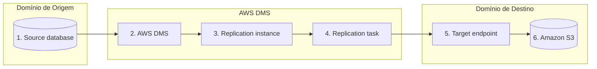

---

### Tipos de tarefas de replicação

Com o AWS DMS, você pode criar uma instância de replicação, que executa tarefas de replicação. Uma tarefa de replicação pode consistir em três fases principais:

  * Migrar dados existentes (Carga completa)
  * Aplicação de alterações em cache
  * Replicar apenas as alterações de dados (captura de dados de alteração)

#### Carga completa

A migração completa consiste em uma única execução dos dados existentes. Quaisquer alterações feitas no banco de dados durante essa migração inicial são armazenadas em cache. 

#### Aplicação de alterações em cache 

A segunda fase consiste na aplicação das alterações em cache. Após a conclusão da carga completa, o AWS DMS começa a aplicar as alterações que ocorreram até aquele momento.

Após a conclusão da tarefa de carga completa, o AWS DMS começa a coletar as alterações como transações para a fase de replicação contínua. Depois que o AWS DMS aplica todas as alterações em cache, as tabelas ficam transacionalmente consistentes. Nesse ponto, o AWS DMS passa para a fase de replicação contínua.

#### Replicação em andamento 

A terceira fase é a replicação contínua, também conhecida como captura de dados de alteração (CDC), que mantém os armazenamentos de dados de origem e destino sincronizados.

Após o carregamento da tabela (Tarefa 1) e a aplicação das alterações em cache (Tarefa 2), o AWS DMS realiza a replicação contínua.

O AWS DMS lê as alterações dos logs de transações do banco de dados de origem, extrai essas alterações, converte-as para o formato de destino e as aplica ao destino. Esse processo proporciona replicação quase em tempo real para o destino, reduzindo a complexidade do monitoramento da replicação.

A seguir, apresentamos dois tipos de cargas de trabalho de CDC:

  * Operações somente de inserção
  * O CDC completo, que inclui operações de atualização e exclusão, também está disponível.

| Aspecto	| CDC (somente encarte) | CDC completo (com atualizações e exclusões) | 
|:---|:---|:---|
| Casos de uso comuns | Adequado para dados somente de acréscimo, como registros de logs. | Aplica-se a conjuntos de dados dinâmicos onde os registros são modificados ou eliminados. | 
| Operações de dados | Apenas inserções	| Envolve inserções, atualizações e exclusões, exigindo o gerenciamento de registros existentes. | 
| Impacto no desempenho | Geralmente mais baixo, otimizado para inserções | Maior, devido às etapas adicionais necessárias para localizar, modificar ou excluir registros existentes. | 
| Consistência dos dados | Fácil de manter, pois os dados são apenas adicionados. | Garantir consistência e integridade em todas as transações é um desafio maior. | 
| Método do CDC	| Captura eficiente de novas inscrições. | Pode ser necessário utilizar métodos sofisticados para capturar e replicar as alterações com precisão, incluindo registros de transações ou gatilhos. | 

---

### AWS DataSync

O AWS DataSync é um serviço de transferência de dados otimizado para mover grandes volumes de dados baseados em arquivos e objetos de, para e entre serviços de armazenamento da AWS.

Exemplos de dados baseados em arquivos incluem o seguinte:

  * Repositórios de conteúdo (diretórios pessoais de usuários, arquivos de projeto, arquivos digitais)
  * Bibliotecas de mídia (coleções de arquivos de vídeo, áudio e imagem)
  * Arquivos de pesquisa, engenharia e simulação
  * Arquivos de log ou backups baseados em arquivos de dados críticos de aplicativos corporativos.

O DataSync dimensiona e gerencia automaticamente o agendamento, o monitoramento, a criptografia e a verificação das suas transferências de arquivos e objetos. Com o DataSync, você paga apenas pela quantidade de dados copiados, sem compromissos mínimos ou taxas iniciais.

---

## Criar catalogo de dados

Concluimos com sucesso a ingestão de seus bancos de dados e arquivos existentes na zona de dados brutos de seu data lake na AWS. Além disso, implementamos a replicação contínua para manter seu data lake sincronizado com seu data center local. 
Agora, desejamos acessar os dados como se fossem tabelas, por exemplo, de forma semelhante ao SQL. Também queremos garantir a consistência da qualidade dos dados e a existência de regras claras de propriedade e acesso.

A solução é catalogar todos os dados recebidos usando um componente do AWS Glue. O AWS Glue consolida recursos de integração de dados em um único serviço. Isso inclui conectar-se a diferentes fontes de dados, descobrir dados, catalogá-los, garantir a qualidade dos dados e transformá-los.

A ferramenta de catalogação é o AWS Glue Data Catalog, que é o repositório central de metadados para todos os ativos de dados no data lake. O catálogo consiste em uma coleção de tabelas organizadas em bancos de dados.

Embora seja possível adicionar metadados ao catálogo manualmente, o AWS Glue oferece recursos chamados crawlers para preencher o Catálogo de Dados. Os crawlers adicionam automaticamente novas tabelas, novas partições a tabelas existentes e novas versões de definições de tabela. Eles podem examinar dados em todos os tipos de repositórios, classificar os dados, extrair informações de esquema e armazenar os metadados automaticamente no Catálogo de Dados do AWS Glue.

Quando os rastreadores examinam seus dados, eles usam classificadores para determinar o esquema dos dados. Os classificadores comparam os dados a um conjunto conhecido de tipos de esquema ou a tipos personalizados que você especificou. Quando há uma correspondência, os dados são extraídos e gravados no Catálogo de Dados do AWS Glue.

Precisamos criar três crawlers separados, um para cada pasta em seu bucket de zona bruta: a pasta de vendas, a pasta de campanhas de marketing e a pasta de cliques no site.

Para cada rastreador, selecionamos os seguintes parâmetros:

  * Para a fonte de dados, eles especificaram a pasta apropriada da zona raw do Amazon S3.
  * Para o destino, eles selecionaram um banco de dados AWS Glue, que haviam criado previamente, chamado db_raw.
  * Em seguida, eles selecionaram uma função do AWS Identity and Access Management (IAM) com permissões para acessar seu data lake na AWS.
  * Por fim, eles configuraram um cronograma diferente para cada rastreador.

Após a criação dos rastreadores, os agendadores os executaram. Eles inferiram automaticamente os esquemas iniciais e as estruturas de partição das tabelas da zona bruta. Em seguida, preencheram os metadados descobertos nas tabelas apropriadas do catálogo de dados, denominadas  **db_raw.sales**, **db_raw.marketing_campaigns** e **db_raw.website_clicks**.

Após a catalogação, os dados brutos da Example Corp estão prontos para serem consultados e transformados de maneira consistente, utilizando uma variedade de serviços de dados da AWS desenvolvidos especificamente para essa finalidade.

---

### Catálogo de Dados

O AWS Glue Data Catalog é o repositório central de metadados para todos os seus ativos de dados armazenados nos locais do seu data lake.

O Data Catalog integra-se perfeitamente com outras ferramentas de análise da AWS, como as seguintes: 

  * O Amazon Athena  depende do Catálogo de Dados para armazenar e recuperar metadados sobre as fontes de dados (tabelas, colunas, tipos de dados etc.) que você deseja consultar. 
  * O Amazon EMR  pode acessar diretamente os metadados armazenados no Catálogo de Dados, permitindo que ele compreenda a estrutura e a localização dos dados que precisa processar. 

Você pode usar os metadados no catálogo para consultar e transformar esses dados de maneira consistente em uma ampla variedade de aplicações. 
Esses metadados são armazenados na forma de tabelas, que contêm informações como localização, esquema e métricas de tempo de execução dos dados.

___

#### Exemplo de uma tabela de catálogo de dados

| Entrada de tabela	| Descrição | 
|:---|:---|
| Nome | Este é o nome da tabela. |
| Nome do banco de dados | Este é o banco de dados ao qual a tabela pertence. | 
| Descritor de armazenamento | Isso define as propriedades de armazenamento físico dos dados da seguinte forma: Formato de dados (por exemplo, .csv, Parquet) Localização dos dados no Amazon S3 Bibliotecas de serialização e desserialização | 
| Esquema | Isso inclui o esquema (nomes das colunas e tipos de dados), como o seguinte: **nome: string** , **ano: inteiro** , **Preço: dobro** | 
| Chaves de Partição | Estas são as colunas usadas para particionar os dados, o que pode melhorar o desempenho das consultas.  O exemplo a seguir mostra dados particionados por dia, referentes a dois dias de ingestão: **Partição 1**: [ano=2024/mês=3/dia=13] => Localização = s3://doc-example-bucket/data/mytable/year=2024/month=3/day=13  **Partição 2**: [ano=2024/mês=3/dia=14/] => Localização = s3://doc-example-bucket/data/mytable/year=2024/month=3/day=14/
| Parâmetros | São pares de chave-valor que armazenam metadados adicionais sobre a tabela, como a descrição da tabela, o criador e a data de criação. | 
| Tipo de tabela | Isso indica o tipo de tabela, como EXTERNAL_TABLE, VIRTUAL_VIEW, e assim por diante. | 

---

### Preenchendo o catálogo

Entidades de software chamadas crawlers  populam o Catálogo de Dados. Os crawlers descobrem os dados, reconhecem sua estrutura e, em seguida, adicionam metadados ao Catálogo de Dados. Os crawlers usam classificadores para detectar e inferir esquemas. 

Para saber mais sobre outras maneiras de preencher o catálogo de dados, selecione as seguintes abas.

#### Adicione metadados manualmente 

Adicione e atualize manualmente os detalhes da tabela usando o console do AWS Glue ou chamando a API por meio da AWS Command Line Interface (AWS CLI). 
Agora que você já aprendeu como adicionar metadados manualmente, vá para a próxima aba para aprender sobre como executar consultas em linguagem de definição de dados (DDL). 

#### Executar consultas DDL

Execute consultas DDL no Athena, em trabalhos do AWS Glue e em trabalhos do AWS EMR. 
DDL é um subconjunto de SQL usado para definir e gerenciar a estrutura de um banco de dados. É responsável por criar, modificar e excluir objetos do banco de dados, como tabelas, índices, visualizações, procedimentos armazenados e outros componentes do banco de dados.

---

### Crawlers

Os crawlers do AWS Glue podem analisar dados em todos os tipos de repositórios, classificá-los, extrair informações de esquema e armazenar os metadados automaticamente no Catálogo de Dados.

Quando um crawler é executado, ele realiza automaticamente as seguintes ações.

#### Utiliza um classificador para descobrir e inferir a estrutura dos dados.

Os crawlers do AWS Glue podem usar classificadores integrados ou personalizados para examinar os dados no armazenamento de dados e reconhecer seu formato, esquema e propriedades associadas. 

#### Agrupa dados em tabelas ou partições.

Os crawlers do AWS Glue inferem tipos de arquivo e esquemas. Eles também identificam automaticamente a estrutura de partições do seu conjunto de dados ao preencher o Catálogo de Dados. Ao particionar seus dados, você pode restringir a quantidade de dados examinados por cada consulta, o que melhora o desempenho e reduz os custos.

#### Preenche os metadados no Catálogo de Dados.

Ao concluir, o rastreador do AWS Glue cria ou atualiza uma ou mais tabelas no Catálogo de Dados com as definições de tabela e partições correspondentes. Você pode configurar como o rastreador adiciona, atualiza e exclui tabelas e informações de partição. 

#### Cria um esquema único para cada caminho do Amazon S3.

Você pode configurar o rastreador para combinar esquemas compatíveis em uma definição de tabela comum. Se os esquemas comparados coincidirem, ou seja, se o limite de particionamento for superior a 70%, os esquemas serão considerados partições de uma tabela. Caso contrário, o rastreador criará uma tabela para cada caminho do Amazon S3, resultando em um número maior de tabelas. Você pode especificar o limite máximo de tabelas que um rastreador pode gerar.

#### Opções de configuração

A seguir, apresentamos algumas opções e recursos de configuração do rastreador AWS Glue que você deve considerar:

  * Você pode configurar o rastreador para examinar vários armazenamentos de dados em uma única execução. 
  * Você pode executar rastreadores de acordo com uma programação ou sob demanda, ou pode invocá-los com base em um evento para garantir que seus metadados estejam atualizados.
  * Recomenda-se escolher a configuração padrão de atualização contínua das tabelas do Catálogo de Dados. Dessa forma, os metadados do Catálogo de Dados estarão sempre sincronizados com o data lake do Amazon S3.
  * Você pode configurar o rastreador para verificar apenas novas subpastas e realizar rastreamentos incrementais para adicionar novas partições no AWS Glue.

---

### Classificadores

Ao definir um rastreador, você pode usar classificadores integrados ou escolher um ou mais classificadores personalizados para ler os dados e determinar sua estrutura ou esquema. Quando o rastreador é executado, o primeiro classificador da sua lista que reconhecer com sucesso seu repositório de dados é usado para criar um esquema para sua tabela. As considerações para cada tipo de classificador são as seguintes:

  * Classificadores integrados:  O AWS Glue fornece classificadores integrados para inferir esquemas a partir de arquivos comuns com formatos como JSON, .csv e Apache Avro. 
  * Classificadores personalizados:  Para configurar os resultados de uma classificação, você pode criar um classificador personalizado. Você fornece o código para os classificadores personalizados, e eles são executados na ordem que você especificar. Você define seus classificadores personalizados em uma operação separada antes de definir os rastreadores. 

---

### Características e considerações do Catálogo de Dados

A seguir, apresentamos alguns recursos e considerações para o uso do Catálogo de Dados:

  * Cada conta da AWS possui um Catálogo de Dados em cada Região. 
  * Você pode editar manualmente os esquemas no Catálogo de Dados. Por exemplo, você pode alterar os tipos de dados das colunas, adicionar novas colunas ou modificar as propriedades das tabelas.
  * O Catálogo de Dados mantém um histórico completo das versões do esquema, permitindo comparar e analisar como seus dados mudaram ao longo do tempo.
  * É possível calcular estatísticas em nível de coluna para tabelas do Catálogo de Dados, como valor mínimo, valor máximo, total de valores nulos e total de valores distintos. 
  * Você pode medir e monitorar a qualidade dos seus dados usando o serviço AWS Glue Data Quality.

---

## Transformar dados

Neste ponto, os dados foram descobertos, catalogados e podem ser pesquisados. Embora os cientistas de dados possam usar esses dados brutos para análises mais aprofundadas, ainda é necessário algum trabalho para torná-los utilizáveis ​​por outros públicos, como analistas de dados e de negócios. Agora, os dados precisam ser preparados, limpos e transformados.

Temos cinco objetivos para esta etapa do seu fluxo de trabalho:

  * Converter os dados brutos do formato CSV atual para o formato Apache Parquet, orientado a colunas.
  * Lidar com valores ausentes ou nulos.
  * Redija dados sensíveis.
  * Padronize os nomes das colunas e os tipos de dados.
  * E, por fim, agregue e combine tabelas para obter mais informações sobre o negócio.

Nesta etapa, são possíveis diversas operações, como remover duplicados, preencher valores ausentes, renomear campos e unir tabelas, entre outras. A maioria dessas operações faz parte das funções de extração, transformação e carregamento (ETL).

Existem diversas abordagens para criar trabalhos de ETL com o AWS Glue.

  * Uma abordagem é escrever código em Python ou Scala usando o editor de scripts do AWS Glue. Isso envolve escrever código para definir a lógica de transformação de dados. Oferece flexibilidade e opções de personalização, sendo ideal para lidar com transformações complexas.
  * Outra abordagem é usar notebooks do AWS Glue Studio. Ao criar um job, você pode executar seções de código uma de cada vez e obter feedback imediato. Quando estiver satisfeito, você pode promover o notebook como um job de ETL do AWS Glue.
  * Uma terceira abordagem é o AWS Glue Studio Visual ETL, que fornece uma interface visual para criar fluxos de trabalho ETL sem escrever código.

Optamos por usar o AWS Glue Studio, uma solução visual de ETL.

As principais etapas para a criação de empregos utilizando essa abordagem são:

  * Defina suas fontes de dados.
  * Aplique transformações a essas fontes.
  * Defina seus objetivos de dados.
  * Eles configuraram e executaram duas tarefas para atingir seus objetivos.

Na primeira, eles combinaram várias transformações em uma única tarefa.

O processo preencheu valores ausentes e nulos e, em seguida, ocultou dados sensíveis. Depois, padronizou os nomes das colunas e converteu o formato dos dados brutos de CSV para Apache Parquet. Por fim, gravou os resultados nas tabelas limpas da zona do Amazon S3.

Além disso, a tarefa criou bancos de dados correspondentes no AWS Glue Data Catalog.

Com a segunda tarefa, eles queriam calcular o impacto de suas campanhas de marketing nas vendas e nos cliques no site, e gravar os resultados em seu bucket de zona selecionada no Amazon S3.

Para calcular o impacto das campanhas de marketing nas vendas, eles reuniram e agregaram seus dados de marketing e vendas por categorias de produtos.

Para analisar o impacto da campanha de marketing no tráfego do site, eles reuniram e agregaram os dados de suas campanhas de marketing e cliques no site.

Cada uma dessas tarefas foi configurada com agendamentos repetitivos para mover dados brutos para limpos e, em seguida, de limpos para curados. Além disso, para evitar o reprocessamento de todo o conjunto de dados sempre que novos dados eram adicionados ou quando uma tarefa era interrompida, foi implementado o recurso de favoritos do AWS Glue Jobs.

Neste ponto, os dados da Example Corp foram limpos e transformados, estando prontos para serem utilizados por analistas de dados, cientistas de dados e outras partes interessadas.

---

### Processamento dos dados 

Os dados brutos recebidos geralmente estarão em formatos diferentes e com qualidade variável. Eles precisam ser processados ​​para se tornarem úteis nas etapas posteriores de análise do fluxo de trabalho.

Os termos preparação, limpeza e transformação são frequentemente usados ​​para descrever ações na etapa de processamento. Essas ações são realizadas usando funções de extração, transformação e carregamento (ETL). 

  * Trecho: Coletando dados de diversas fontes de dados
  * Transformar: Converter sistematicamente dados brutos em formatos utilizáveis.
  * Carregamento:  Movimentação dos dados transformados para o armazenamento do data lake ou outro local.
  
A AWS oferece diversas maneiras de transformar, limpar e preparar seus ativos de dados, além de criar fluxos de trabalho de transformação.

| Caso de uso | Serviços da AWS	| Considerações | 
|:---|:---|:---|
| Processamento de Big Data | Amazon EMR [ **Amazon EMR em clusters EC2**, **Amazon EMR sem servidor**, **Amazon EMR em clusters EKS** ] | Confortável em escrever código Apache Spark | 
| **Análise de log improvisada** **Geração de relatórios** **Inteligência de negócios** | Amazon Athena | [ **Sem servidor (reduz custos)** **Bom para transformações básicas** ] | 
| Agendamento e orquestração | [ **Amazon EventBridge com AWS Step Functions** **Fluxos de trabalho gerenciados da Amazon para Apache Airflow (Amazon MWAA)** ] | [ Criar pipelines de transformação orientados a eventos,  Orquestrar fluxos de trabalho de transformação de pipelines]

*Além dos serviços listados na tabela anterior, um dos principais serviços para criar e executar fluxos de trabalho ETL é o AWS Glue. Explore o próximo tópico para saber mais sobre o AWS Glue.*

--- 

### AWS Glue

O AWS Glue é um serviço de integração de dados sem servidor que facilita a integração de dados de múltiplas fontes. Suas funcionalidades incluem a conexão com diferentes fontes de dados, descoberta de dados, catalogação de dados e transformação de dados.

Como o AWS Glue é sem servidor, você não precisa provisionar ou gerenciar manualmente nenhuma infraestrutura. O AWS Glue cuida do provisionamento, configuração e escalonamento dos recursos necessários para executar seus trabalhos de ETL. Você paga apenas pelos recursos consumidos enquanto seus trabalhos estão em execução.

O AWS Glue é um serviço multifacetado que oferece uma ampla gama de recursos e funções para processamento de dados.

Você pode desenvolver seus trabalhos de ETL no AWS Glue Studio (ETL visual, notebooks, editor de scripts), com notebooks do Amazon SageMaker Studio ou com notebooks e IDEs locais. Em todos esses casos, você pode executar seu código no mecanismo Spark distribuído e sem servidor subjacente ao AWS Glue.

A seguir, apresentamos uma visão geral de muitos dos componentes do AWS Glue. Esta não é uma lista exaustiva, nem detalha todas as opções disponíveis. Para obter informações mais detalhadas, consulte os links no final desta lição.

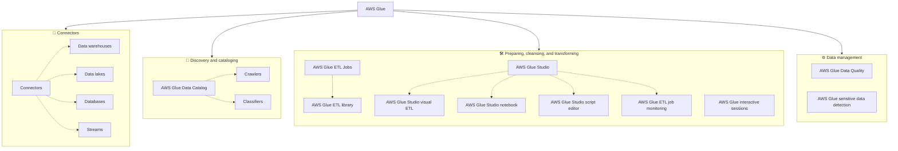

---

### Conectores

Um conector é um trecho de código que facilita a comunicação entre o AWS Glue e seu armazenamento de dados (origem ou destino). 

Você pode usar conectores integrados, conectores oferecidos no AWS Marketplace ou criar conectores personalizados.

Para saber mais, acesse Usando conectores e conexões com o AWS Glue Studio.(abre em uma nova aba).

**Exemplos de conectores incluem os seguintes:**

  * Data warehouses: Amazon Redshift
  * Data lakes: Amazon S3
  * Bancos de dados relacionais: JDBC, Amazon Aurora, MariaDB, MySQL, Microsoft SQL Server, Oracle Database, PostgreSQL
  * Bancos de dados não relacionais: Amazon DocumentDB, MongoDB, Amazon OpenSearch
  * Streams: Apache Kafka, Amazon Kinesis
  * Outros provedores de nuvem

---

### Descoberta e catalogação

Os dados provavelmente serão armazenados em diversos formatos, com diferentes níveis de qualidade e acessibilidade. Após serem inseridos no data lake, precisam ser catalogados para que possam ser pesquisados. 

#### Catálogo de dados de cola

O Catálogo de Dados do AWS Glue é o repositório central de metadados para todos os ativos de dados no data lake. O catálogo consiste em uma coleção de tabelas organizadas em bancos de dados.

O objetivo do Catálogo de Dados é permitir o acesso aos dados do data lake como se fossem tabelas (por exemplo, de forma semelhante ao SQL).

  * Os Crawlers são recursos do AWS Glue que examinam os dados e preenchem automaticamente o catálogo de dados com metadados sobre os ativos de dados.
  * Os rastreadores usam classificadores para detectar o esquema dos dados. Os classificadores comparam os dados a um conjunto conhecido de tipos de esquema ou a tipos personalizados que você especificou. Quando há uma correspondência, os dados são extraídos e gravados no Catálogo de Dados do AWS Glue.

### Preparar, limpar e transformar

A maior parte da funcionalidade do AWS Glue está nesta etapa. É aqui que você configura e executa seus trabalhos de ETL. 

#### Tarefas ETL de cola

Os trabalhos de ETL do AWS Glue são adequados para transformações de dados complexas.

São flexíveis e personalizáveis. Por exemplo, você pode:

Escreva um código que defina a lógica de transformação usando linguagens de script como Python ou Scala.
Encadeie programaticamente diferentes componentes do AWS Glue (por exemplo, crawlers, jobs, triggers) em fluxos de trabalho. 

#### Biblioteca AWS Glue ETL

Você pode usar o código da biblioteca AWS Glue ETL, que estende o Apache Spark com tipos de dados e operações adicionais para otimizar os fluxos de trabalho de ETL.

A biblioteca utiliza o AWS Glue DynamicFrames. Isso é útil ao lidar com dados complexos, onde o mesmo campo pode ser inconsistente em todo o conjunto de dados.

Para saber mais, acesse a  classe DynamicFrame.(abre em uma nova aba).

#### Sessões interativas do AWS Glue

As sessões interativas do AWS Glue fornecem acesso interativo sob demanda a um ambiente de execução Spark remoto.

As sessões interativas do AWS Glue podem ser usadas com o seguinte:

  * Notebooks Jupyter
  * Cadernos do SageMaker Studio
  * IDEs como Microsoft Visual Studio Code, IntelliJ, PyCharm

#### AWS Glue Studio

O AWS Glue Studio é uma interface gráfica que facilita a criação, execução e monitoramento de trabalhos de integração de dados no AWS Glue. A seguir, estão os componentes do AWS Glue Studio.

#### ETL visual do AWS Glue Studio

Com esta interface gráfica de arrastar e soltar, você pode:

  * Criar pipelines ETL
  * Analise seus dados para ver como eles são transformados nas diferentes etapas. 
  * Obtenha inferência de esquemas em tempo real sem precisar catalogar seus dados.

#### Notebook do AWS Glue Studio

Fornece uma interface de notebook baseada em Jupyter Notebooks, que você pode usar para fazer o seguinte:

  * Explore e visualize dados.
  * Escreva o código e visualize o resultado sem precisar executar uma tarefa completa.
  * Melhore a legibilidade e a organização do código com células Markdown.
  * Execute código em um ambiente distribuído sem servidor.
  * Execute o código do notebook como um trabalho ETL do AWS Glue.

#### Editor de scripts do AWS Glue Studio

Você pode usar o editor de scripts do AWS Glue Studio para editar um script de trabalho ou carregar seu próprio script.

#### Monitoramento de tarefas ETL do AWS Glue

O monitoramento de tarefas ETL do AWS Glue oferece os seguintes recursos:

  * Monitore milhares de tarefas a partir de uma única tela.
  * Veja as recomendações e os registros de depuração.
  * Monitore o uso de recursos e identifique tarefas dispendiosas.
  * Filtrar por detalhes da vaga e períodos de tempo.

---

### Gestão de dados

Utilize serviços e funcionalidades especializadas para gerenciar dados. 

#### Qualidade dos dados do AWS Glue

Meça a qualidade dos dados durante todo o processo de ETL e tome as medidas necessárias, tais como:

  * Avalie a qualidade no Catálogo de Dados do AWS Glue (qualidade dos dados em repouso).
  * Verificar a qualidade dos dados em trabalhos ETL do AWS Glue para identificar e filtrar dados incorretos antes que sejam carregados no data lake (qualidade dos dados em trânsito).

As regras de qualidade de dados são definidas com a Linguagem de Definição de Qualidade de Dados (DQDL). Você pode obter recomendações de regras ou criar suas próprias regras personalizadas.

Para saber mais, consulte a referência da Linguagem de Definição de Qualidade de Dados.(abre em uma nova aba)

#### Detecção de dados sensíveis do AWS Glue

Use a transformação Detect PII para detectar, mascarar ou remover informações confidenciais dos seus dados durante o processamento.

O AWS Glue agora consegue detectar 250 tipos de entidades confidenciais de mais de 50 países. Além disso, ele pode detectar identidades por meio de um padrão de expressão regular fornecido por você.

Para saber mais, consulte Detectar e processar dados sensíveis.(abre em uma nova aba).

---

### Mecanismos de integração de dados

Escolha o mecanismo apropriado para cada carga de trabalho, com base nas características da sua carga de trabalho e nas preferências dos seus desenvolvedores e analistas. 

#### AWS Glue para Shell Python

Execute código em um mecanismo Python sem servidor de nó único. Ideal para conjuntos de dados pequenos ou cargas de trabalho com baixa latência. 

#### AWS Glue para Apache Spark

Acelere a ingestão, o processamento e a integração de dados de cargas de trabalho em lote e de fluxo contínuo usando um ambiente de computação distribuída sem servidor. 

---

### Fornecer dados para consumo

Neste ponto ja catalogamos, limpamos e transformamos os seus dados. Agora estamos prontos para serem disponibilizar esses dados para usuários como analistas de dados, cientistas de dados e outras partes interessadas.

Um dos aspectos mais poderosos do sistema de análise de dados da AWS é a capacidade de analisar dados sem precisar movê-los entre diferentes locais de armazenamento.

Com o Amazon Athena, você pode consultar dados diretamente no Amazon S3. Isso significa que você não precisa copiar os dados para outro local. O Athena usa sintaxe SQL padrão e permite consultar diversos formatos de dados, incluindo dados estruturados, semiestruturados e não estruturados. O Athena é serverless (sem servidor). Ele provisiona recursos automaticamente e escala para cima ou para baixo de acordo com a demanda.

O Athena é ideal para consultas rápidas, exploração de dados e análise ágil de dados no Amazon S3. É particularmente útil para organizações com necessidades de consulta variáveis ​​ou pouco frequentes, pois você paga apenas pelas consultas executadas.

O uso de gráficos para visualizar dados pode ajudar a obter insights que seriam difíceis de entender usando tabelas numéricas ou texto simples.

O Amazon QuickSight é um serviço de Business Intelligence (BI) baseado na nuvem que permite criar dashboards interativos, visualizações e relatórios a partir de diversas fontes de dados.

Utilizando dados do Amazon Redshift Spectrum, Athena e outras fontes, você pode criar gráficos, tabelas e mapas para visualizar os dados e, em seguida, combinar várias visualizações em um dashboard.

É possível aplicar filtros e adicionar parâmetros para realizar análises interativas e instantâneas. Tudo isso pode ser compartilhado com as partes interessadas para aumentar a colaboração e obter novos insights a partir dos dados.

O QuickSight também pode ser integrado a aplicativos, portais voltados para o cliente e sites da empresa.

--- 

#### Amazon Athena

Athena é um serviço de consulta interativa fornecido pela AWS que você pode usar para analisar dados armazenados no Amazon S3 usando consultas SQL padrão.

--- 

### Características importantes de Atena

O Athena pode usar comandos SQL padrão para realizar consultas de dados diretamente no Amazon S3, sem a necessidade de pipelines de dados complexos ou processos ETL.

Explore as seções a seguir para saber mais sobre os principais recursos e funcionalidades.

**Preços por consulta.** : Você paga apenas pelas consultas executadas, com base na quantidade de dados analisados. Não há custos iniciais nem cobranças por clusters ociosos.

**Integração com os serviços de análise da AWS** : O Athena se integra perfeitamente a outros serviços de análise da AWS, como o AWS Glue (para catalogação de dados) e o QuickSight (para visualização de dados).

**Particionamento e compressão de dados** : O Athena oferece suporte ao particionamento e à compressão de dados, o que pode reduzir significativamente os custos de consulta e melhorar o desempenho.

**Consultas federadas** : O Athena suporta consultas federadas, permitindo que você consulte dados em diversas fontes, incluindo bancos de dados relacionais e outros armazenamentos de dados.

---

### Casos de uso comuns para Athena

O Athena é amplamente utilizado em data lakes da AWS. A seguir, alguns casos de uso comuns.

**Análise de logs** : O Athena é comumente usado para analisar dados de log armazenados no Amazon S3, como logs de servidores web, logs de aplicativos ou logs de dispositivos da Internet das Coisas (IoT).

**Tarefas ETL** : O Athena pode ser usado como parte de um pipeline ETL para extrair dados do Amazon S3. O Athena pode transformar os dados usando consultas SQL e carregá-los em outros armazenamentos de dados ou ferramentas de análise.

**consulta de data lake** : O Athena permite consultar e analisar dados armazenados em um data lake (Amazon S3) sem a necessidade de pipelines de dados complexos ou processos ETL.

**Exploração de dados improvisada** : A Athena possui recursos de consulta instantânea que analistas e cientistas de dados podem usar para explorar e analisar com eficiência os dados armazenados no Amazon S3.

**BI e relatórios** : O Athena pode ser usado em conjunto com ferramentas de visualização, como o QuickSight, para gerar relatórios e painéis com base em dados armazenados no Amazon S3.

---

### Utilizando o Athena para analisar dados do Amazon S3

A seguir, uma descrição geral dos passos para configurar o Athena para consultar dados diretamente no Amazon S3:

1. Crie um bucket S3

       Athena trabalha com dados no Amazon S3.

2. Crie um banco de dados e uma tabela no Athena.

        No console do Athena, use a sintaxe SQL para criar um novo banco de dados para armazenar as definições das suas tabelas.
        Em seguida, crie uma nova tabela que aponte para os seus dados armazenados no Amazon S3. O Athena usa o catálogo de dados do AWS Glue para armazenar os metadados do banco de dados e das tabelas. 

4. Executar consultas SQL

        Execute consultas SQL em seus dados diretamente no console do Athena.
        O Athena oferece suporte a um subconjunto da sintaxe SQL, incluindo SELECT, JOIN, GROUP BY e muito mais.

6. Analisar os resultados da consulta

        Analise e explore os dados no console ou baixe os resultados como um arquivo .csv para análises posteriores.

7. Otimizar o desempenho

        Para conjuntos de dados grandes ou consultas complexas, otimize o desempenho particionando seus dados,
        compactando-os ou convertendo-os para um formato colunar como o Apache Parquet.

9. Monitorar e controlar os custos

        Os custos de utilização do Athena baseiam-se na quantidade de dados analisados ​​pelas suas consultas.
        Monitore a quantidade de dados analisados ​​no console do Athena e configure alertas de faturamento para controlar os custos.

11. Agendar consultas recorrentes (opcional)

        Agende consultas repetidas usando o Amazon EventBridge em combinação com funções AWS Lambda ou AWS Step Functions.

---

#### QuickSight

O QuickSight é um serviço de BI baseado na nuvem usado para criar painéis interativos, visualizações e relatórios a partir de diversas fontes de dados. 

### Principais características do QuickSight

Para saber mais sobre os principais recursos e funcionalidades, explore as seguintes categorias. 

**Integração de dados** :  O QuickSight suporta diversas fontes de dados, incluindo as seguintes:

 * Fontes de dados da AWS, como as seguintes:
    * Atena
    * Amazon Redshift
    * Amazon Relational Database Service (Amazon RDS)
 * Fontes de dados baseadas na nuvem, como as seguintes:
    * Google BigQuery
    * MariaDB 10.0 ou posterior
    * Microsoft SQL Server 2012 ou posterior
 * Fontes de dados locais, como as seguintes:
    * MySQL 5.1 ou posterior
    * PostgreSQL 9.3.1 ou posterior

*Para obter uma lista completa das fontes de dados suportadas, consulte Fontes de Dados Suportadas.(abre em uma nova aba).*

**SPICE** : O mecanismo de cálculo paralelo e em memória super-rápido (SPICE) do QuickSight acelera o desempenho das consultas armazenando dados em cache na memória, proporcionando tempos de resposta rápidos para visualizações e análises.

Ao configurar as fontes de dados, você pode escolher entre os modos de consulta direta ou consulta SPICE, conforme descrito a seguir:
 * Consulta direta: Executar a instrução SELECT diretamente no banco de dados.
 * SPICE: Para executar a instrução SELECT em dados que foram previamente armazenados na memória.

**Preparação de dados** : O QuickSight oferece recursos de preparação de dados, como formatação, transformações e cálculos, que você pode usar para limpar e enriquecer seus dados antes da visualização.

**Análises incorporadas** : O QuickSight pode ser incorporado em aplicativos ou sites, permitindo que as organizações forneçam painéis interativos e análises para seus clientes ou usuários finais.

**Segurança e controle de acesso** : O QuickSight oferece suporte à segurança em nível de linha e de coluna, permitindo que os administradores controlem o acesso aos dados com base em funções e permissões de usuário.

---

### Visualizando dados com o QuickSight 

Os passos a seguir fornecem uma visão geral do processo de criação de visualizações e dashboards no QuickSight. As opções e funcionalidades específicas podem variar dependendo do seu conjunto de dados, requisitos e da versão do QuickSight que você está utilizando. 

1. Cadastre-se no QuickSight
        
        Inscreva-se no serviço QuickSight através do Console de Gerenciamento da AWS. 

3. Conecte-se às suas fontes de dados.
        
        Conecte-se diretamente às suas fontes de dados ou use ferramentas de preparação de dados da AWS, como o AWS Glue, para preparar e carregar seus dados no QuickSight.

4. Criar um conjunto de dados 
        
        Crie um conjunto de dados no QuickSight. Isso envolve selecionar as tabelas, visualizações ou arquivos que você deseja incluir no seu conjunto de dados e definir quaisquer transformações ou cálculos de dados necessários. 

5. Crie visualizações e personalize-as.
        
        Crie visualizações usando o QuickSight, incluindo gráficos de barras, gráficos de linhas, gráficos de pizza, gráficos de dispersão e muito mais.
        Personalize cores, fontes, rótulos e outras opções de formatação. Aplique filtros, adicione cálculos e crie hierarquias para analisar seus dados com mais detalhes.

6. Crie painéis de controle e personalize-os.
        
        Combine várias visualizações e conjuntos de dados em um painel de controle único. Organize e redimensione as visualizações, adicione caixas de texto e aplique formatação condicional para destacar pontos de dados importantes.

7. Compartilhar e colaborar 
        
        Compartilhe suas visualizações e painéis com outras pessoas em sua organização ou com partes interessadas externas. Controle as permissões de acesso e habilite recursos colaborativos, como comentários e anotações.

8. Incorporar e integrar com outros serviços da AWS 
        
        Os painéis e visualizações do QuickSight podem ser incorporados em aplicativos ou portais da Web usando o SDK de incorporação do QuickSight ou as APIs do QuickSight.
        Integre o QuickSight com outros serviços da AWS, como Athena, Amazon Redshift e Lambda, para criar pipelines de dados mais avançados e automatizar diversos processos. 
