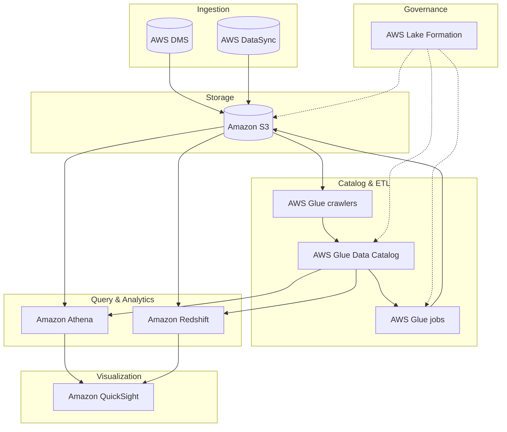
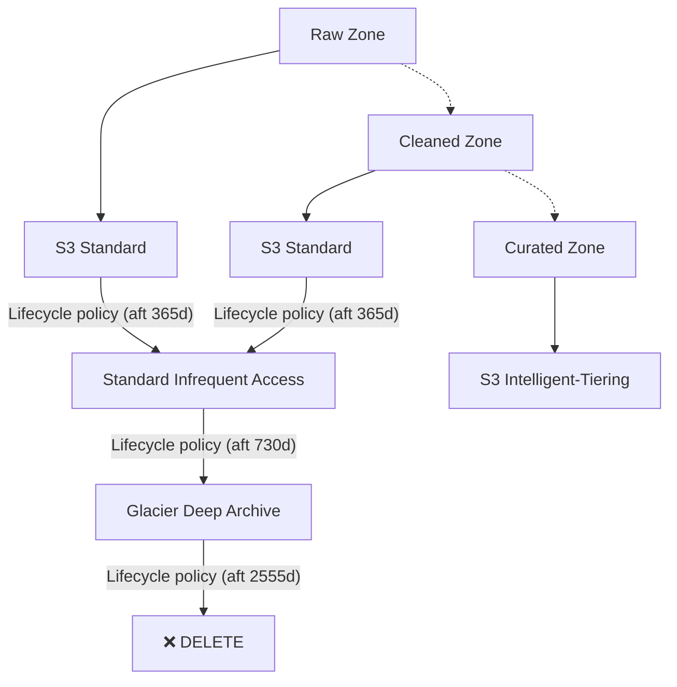
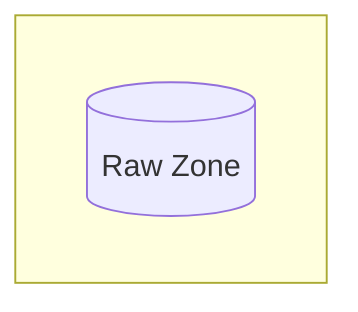
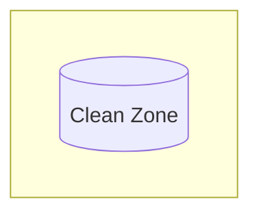
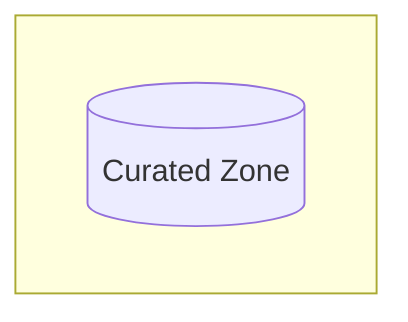
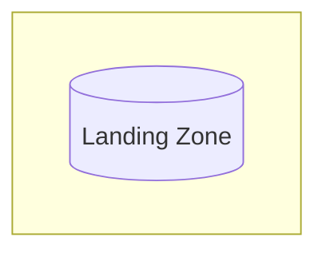
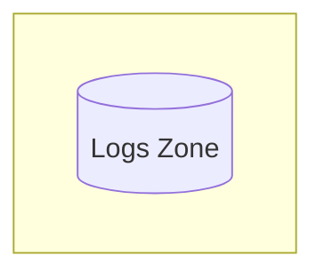
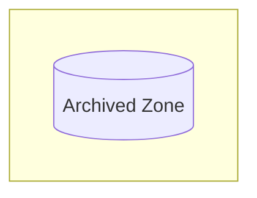
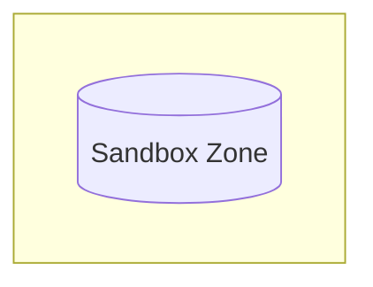

## Construindo uma Solucao de Data Lake

---

Tudo inicia com reuniões de levantamento de informações detalhadas com os consumidores de dados e partes interessadas relevantes.

Essas conversas capturam as necessidades analíticas, restrições de acesso, requisitos de conformidade e aspirações organizacionais. 
A partir desse levantamento, o AWS Lake Formation é utilizado para traduzir esses requisitos em implementações técnicas tangíveis de governança de dados — como políticas de permissão granulares, catalogação centralizada e auditoria de acesso

| Tema | Subtópico | Módulo | Objetivo |
|:---|:---|:---|:---|
| Alinhamento com os Objetivos de Negócios | Alinhamento com os Objetivos de Negócios | Definir metas de negócios para governança de dados | A conversão de aspirações de negócios em implementações técnicas tangíveis começa com reuniões estruturadas de levantamento com consumidores de dados e stakeholders. O AWS Lake Formation, então, materializa essas diretrizes em um catálogo de dados seguro e políticas de acesso alinhadas aos objetivos de negócio. |
| Alinhamento com os Objetivos de Negócios | Alinhamento com os Objetivos de Negócios | Avaliação sistemática e transição de fontes de dados | Após o levantamento detalhado com as partes interessadas, o processo de tradução de objetivos em soluções técnicas envolve avaliar quais fontes de dados (S3, RDS, etc.) devem ser registradas no Lake Formation, quais transformações serão necessárias (via AWS Glue) e como as necessidades de consumo (quem, o quê, quando) informam a criação de zonas de dados e permissões. |
| Alinhamento com os Objetivos de Negócios | Alinhamento com os Objetivos de Negócios | Integração perfeita com o ecossistema analítico | Com base nos requisitos levantados (ex.: consumidores precisam de acesso a tabelas específicas, com filtros por linha/coluna), o Lake Formation permite a integração perfeita dessas políticas ao ecossistema analítico (Athena, EMR, Redshift, QuickSight). O objetivo é que os dados certos estejam disponíveis para os consumidores certos, exatamente como definido nas reuniões iniciais. |
| Alinhamento com os Objetivos de Negócios | Alinhamento com os Objetivos de Negócios | Mitigação de riscos e adesão à conformidade | Durante as reuniões de levantamento, identificam-se vulnerabilidades (dados sensíveis, requisitos da LGPD, etc.) e expectativas de conformidade. O Lake Formation é então configurado para mitigar esses riscos por meio de políticas centralizadas, criptografia (integrada com KMS) e auditoria via CloudTrail. A estrutura de controles reflete diretamente as decisões tomadas com os consumidores de dados. |

---

A equipe de engenharia de dados sugeriu a criação de uma arquitetura de data lake na AWS com os seguintes componentes:

  * O Amazon Simple Storage Service (Amazon S3)  serve como base e principal armazenamento do data lake. 
  * O AWS Database Migration Service (AWS DMS) serve para conectar-se aos bancos de dados locais e ingerir os dados no data lake.
  * O AWS DataSync é usado para replicar dados de sistemas de armazenamento conectados à rede (NAS) locais para o Amazon S3.
  * Os crawlers do AWS Glue são usados ​​para rastrear os dados no Amazon S3 e, em seguida, armazenar os metadados descobertos (como definições de tabelas e esquemas) no Catálogo de Dados do AWS Glue .

Após a catalogação dos dados, os trabalhos do AWS Glue podem ser usados ​​para transformar, enriquecer e carregar os dados nos buckets ou zonas S3 apropriados. 

  * O AWS Lake Formation oferece governança unificada para gerenciar centralmente a segurança de dados, o controle de acesso e as trilhas de auditoria.
  * O Amazon Redshift  como seu data warehouse para executar consultas SQL complexas e de baixa latência em seus dados estruturados.
  * O Amazon Athena para realizar consultas pontuais ou sob demanda diretamente no Amazon S3.
  * O Amazon QuickSight  para painéis de business intelligence e visualização de dados.

Com um data lake na AWS, conseguimos maximizar o valor de seus dados, otimizando ao mesmo tempo a segurança, os custos e a eficiência operacional.

---

### Tarefas típicas na construção de um data lake na AWS

#### Tarefa 1: Configurar o armazenamento
O Amazon Simple Storage Service (Amazon S3) serve como base e principal armazenamento do data lake.

#### Tarefa 2: Ingerir dados
O AWS Database Migration Service (AWS DMS) é usado para conectar-se a bancos de dados locais e ingerir os dados no data lake do Amazon S3.
O AWS DataSync é usado para replicar dados de um armazenamento conectado à rede (NAS) local para o Amazon S3.

#### Tarefa 3: Criar registro de dados
Os crawlers do AWS Glue são usados ​​para rastrear os dados no Amazon S3 e, em seguida, armazenar os metadados descobertos (como definições de tabelas e esquemas) no Catálogo de Dados do AWS Glue.

#### Tarefa 4: Processar dados
Após a catalogação dos dados, os trabalhos do AWS Glue podem ser usados ​​para transformar, enriquecer e carregar os dados nos buckets ou zonas S3 apropriados.

#### Tarefa 5: Configurar a segurança
O AWS Lake Formation oferece governança unificada para gerenciar centralmente a segurança de dados, o controle de acesso e as trilhas de auditoria.

#### Tarefa 6: Disponibilizar dados para consumo
O Amazon Redshift  serve como data warehouse para executar consultas SQL complexas e de baixa latência em dados estruturados.
O Amazon Athena é usado para realizar consultas pontuais ou improvisadas.
O Amazon QuickSight é usado para painéis de inteligência de negócios e visualização de dados.

*Não existem duas iniciativas de data lake idênticas. Cada uma é projetada para atender a objetivos e requisitos organizacionais específicos. Este curso apresenta uma solução básica de data lake e opções de configuração a serem consideradas para seus próprios projetos.*

---

### Benefícios dos data lakes da AWS

Um data lake é uma abordagem arquitetônica que permite armazenar todos os seus dados em um repositório centralizado. 
Esses dados podem então ser acessados, transformados e analisados ​​pelo conjunto apropriado de usuários e ferramentas. 
É essencial ser estratégico na gestão dos seus dados e garantir que as medidas de qualidade, governança e segurança estejam em vigor.

#### Escalabilidade:
Ao armazenar grandes volumes e variedades de conjuntos de dados em conjunto, uma solução de data lake da AWS ajuda você a gerar insights orientados por dados usando as ferramentas apropriadas para cada tarefa.

#### Capacidade de descoberta:
Os data lakes permitem descobrir quais dados estão armazenados por meio de rastreamento, catalogação e indexação. Eles também garantem a proteção de todos os seus ativos de dados.

#### A capacidade de compartilhamento
dos Data Lakes permite que diversas funções, como cientistas de dados, desenvolvedores de dados e analistas de negócios, acessem os dados com as ferramentas de análise e aprendizado de máquina (ML) de sua escolha.

#### Agilidade:
Com as opções sem servidor mais avançadas na nuvem, a AWS ajuda a reduzir o trabalho pesado e repetitivo de provisionamento e gerenciamento de infraestrutura.

---

### Configurar Armazenamento

Vamos segmentar o data lake em três buckets distintos do S3. Além disso, para atender às regulamentações do setor e otimizar custos, optaram por usar diferentes classes de armazenamento e políticas de ciclo de vida do Amazon S3.

#### Passo 1

A zona de dados brutos (raw zone) é onde os dados brutos são ingeridos a partir de seus bancos de dados de origem. Esse bucket garante a integridade dos dados, pois o formato original é preservado para futuras auditorias ou necessidades de reprocessamento. 

#### Passo 2 

A zona limpa (clean zone) é onde os dados processados ​​ou transformados são armazenados. As atividades comuns de processamento de dados incluem filtrar anomalias, padronizar formatos e corrigir valores inválidos.

#### Passo 3 

A área de dados selecionados (curated zone) é onde os dados processados ​​são mesclados ou combinados com outros conjuntos de dados e disponibilizados para análises específicas e casos de uso de aprendizado de máquina.

Para cumprir as regulamentações do setor e otimizar custos, podemos utiliza diferentes classes de armazenamento S3 e políticas de ciclo de vida do Amazon S3. 
Por exemplo, optaram pela classe de armazenamento Amazon  S3 Standard tanto para as zonas de dados brutos quanto para as zonas de dados limpos, por ser adequada para cargas de trabalho com alto volume de transações.

Após a curadoria dos dados nessas duas zonas, o acesso a eles é raro. Portanto, para fins de arquivamento, foram criadas várias regras de ciclo de vida do S3 para migrar automaticamente os dados para diferentes classes de armazenamento.

  * Primeira regra:  Após 1 ano, mova todos os arquivos para a classe de armazenamento S3 Standard-Infrequent Access (S3 Standard-IA)  .
  * Segunda regra:  Após 2 anos no S3 Standard-Infrequent Access, mova-os para a classe de armazenamento S3 Glacier Deep Archive .
  * Terceira regra:  Após 7 anos na classe de armazenamento S3 Glacier Deep Archive, exclua ou deixe expirar os dados.

Para a zona curada, eles escolheram a classe S3 Intelligent-Tiering em vez das regras de ciclo de vida do S3. 
O S3 Intelligent-Tiering move automaticamente os dados para a camada de armazenamento mais econômica à medida que os dados esfriam. 
Dessa forma, eles não precisam gerenciar várias regras para os diversos consumidores de dados e casos de uso que acessam a zona curada.

---

### Amazon S3 para data lakes

O Amazon S3 oferece uma base ideal para um data lake devido à sua escalabilidade praticamente ilimitada e alta durabilidade. Ele também proporciona melhor desempenho, segurança e integração com um amplo portfólio de serviços de análise, visualização e aprendizado de máquina. 

| Recurso | Descrição |
|:---|:---|
| Escalabilidade | O Amazon S3 é um armazenamento de objetos em escala de exabytes para armazenar qualquer tipo de dado. Você pode armazenar dados estruturados (como dados relacionais), dados semiestruturados (como arquivos JSON, XML e CSV) e dados não estruturados (como imagens ou arquivos de mídia). Você pode começar com um volume pequeno e expandir seu data lake conforme necessário, sem comprometer o desempenho ou a confiabilidade. | 
| Durabilidade | O Amazon S3 foi projetado para oferecer 99,999999999% (11 noves) de durabilidade de dados. O Amazon S3 Standard cria automaticamente cópias de todos os objetos carregados e as armazena em pelo menos três Zonas de Disponibilidade. Isso significa que seus dados estão protegidos por um modelo de resiliência Multi-AZ e contra falhas no nível do site. O S3 One Zone - Acesso Infrequente (S3 One Zone-IA) cria cópias em uma única Zona de Disponibilidade. | 
| Segurança | O Amazon S3 foi projetado para fornecer segurança e conformidade incomparáveis ​​no armazenamento em nuvem em todas as classes de armazenamento, incluindo gerenciamento de identidade e acesso, verificação de inventário, criptografia automática e muito mais. | 
| Disponibilidade | As classes de armazenamento do Amazon S3 são projetadas para fornecer uma disponibilidade de objetos entre 99,5% e 99,99% em um determinado ano. Isso é garantido por alguns dos acordos de nível de serviço (SLAs) mais robustos da nuvem. | 
| Custo | O armazenamento de ativos de dados geralmente representa uma parcela significativa dos custos associados a um data lake. Ao construir um data lake no Amazon S3, você paga apenas pelos serviços de armazenamento e processamento de dados que realmente utiliza, conforme os utiliza. | 

---

### Zonas ou camadas do data lake

#### Zonas padroes

*A zona de dados brutos armazena os dados brutos conforme são inseridos no data lake. Para preservar a integridade dos dados, recomenda-se manter o formato de arquivo original e ativar o versionamento neste bucket do S3.*

*A zona limpa armazena dados processados ​​ou transformados. Por exemplo, filtragem de anomalias, padronização de formatos e correção de valores inválidos.*

*As lojas Zone, com conteúdo selecionado, combinam, agregam e garantem a qualidade de dados para casos de uso específicos em um formato pronto para consumo.*

#### Alem desses existem alguns zonas adicionais a serem considerados.

*A zona de dados brutos armazena os dados brutos conforme são inseridos no data lake. Para preservar a integridade dos dados, recomenda-se manter o formato de arquivo original e ativar o versionamento neste bucket do S3.*

*Esta zona é usada para registros do Amazon S3 e de outros serviços na arquitetura do data lake. Os registros podem incluir registros de acesso do S3, arquivos de registro do Amazon CloudWatch ou arquivos de registro do AWS CloudTrail.*

*Esta zona é utilizada para armazenar dados históricos, de acesso pouco frequente ou relacionados com a conformidade.*

*Esta zona é utilizada para análises exploratórias e experimentação.*

---

