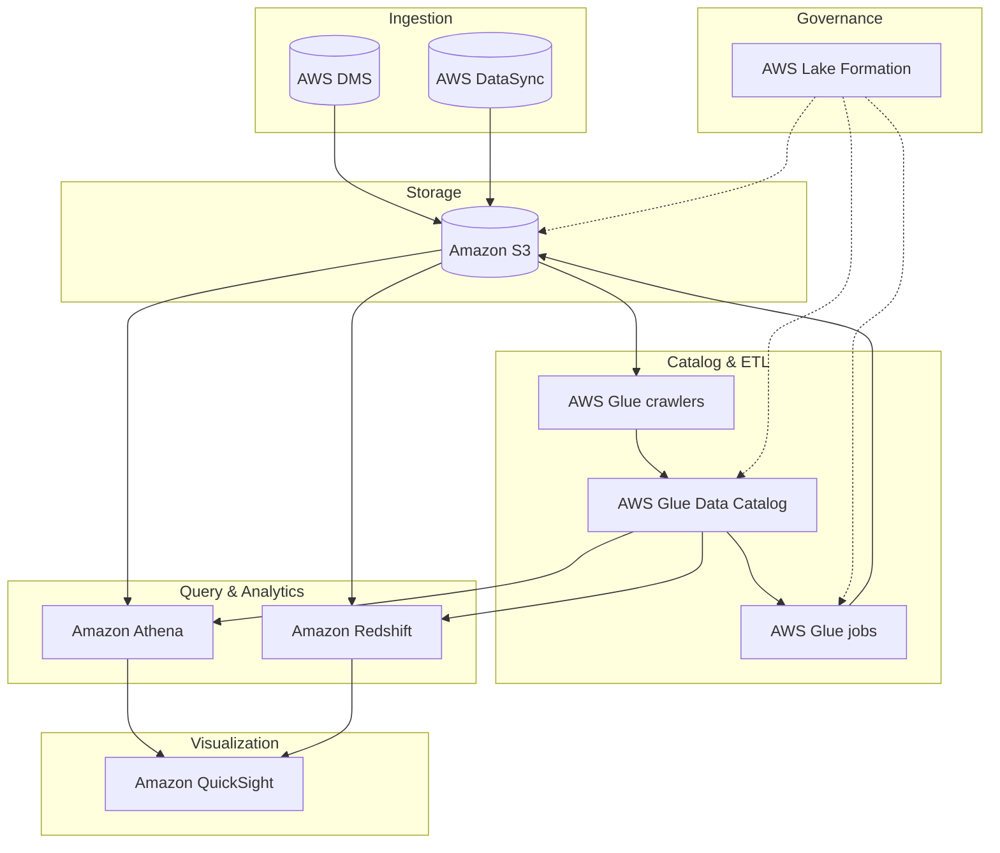

## Construindo uma Solucao de Data Lake

---

Tudo inicia com reuniões de levantamento de informações detalhadas com os consumidores de dados e partes interessadas relevantes.

Converter as aspirações organizacionais em implementações técnicas tangíveis de governança e catálogo de dados, garantindo que toda a adoção do Lake Formation tenha um propósito claro alinhado à estratégia de negócios. 

O AWS Lake Formation utiliza seu catálogo de dados centralizado e mecanismos de governança baseados em permissões granulares (nomeadamente, concessão e revogação de acesso a dados via LF-Tags ou recursos nomeados) 
para conduzir entrevistas interativas com as partes interessadas (através de blueprints de dados e integração com o AWS Glue). 

Ele captura essas aspirações e gera automaticamente a política de governança e o esquema de acesso a dados, vinculando a estratégia aos KPIs antes do provisionamento de quaisquer recursos analíticos.

| Tema | Subtópico | Módulo | Objetivo |
|:---|:---|:---|:---|
| Alinhamento com os Objetivos de Negócios | Alinhamento com os Objetivos de Negócios | Definir metas de negócios para governança de dados | A conversão de aspirações de negócios em implementações técnicas tangíveis de governança de dados, utilizando o AWS Lake Formation, é um esforço multifacetado baseado na arquitetura de negócios e no catálogo de dados centralizado. |
| Alinhamento com os Objetivos de Negócios | Alinhamento com os Objetivos de Negócios | Avaliação sistemática e transição de fontes de dados | O processo de tradução de objetivos de negócios em soluções técnicas durante a adoção do Lake Formation envolve uma avaliação detalhada das fontes de dados existentes (buckets S3, bancos de dados relacionais, etc.). Essa avaliação determina quais conjuntos de dados podem ser registrados no Lake Formation e quais exigem transformação via AWS Glue ou integração com novos pipelines centrados no Lake Formation. Durante a transição, considere segurança (permissões híbridas, LF-Tags), desempenho (particionamento, otimização de consultas) e harmonização com sistemas pré-existentes (via crawlers e catálogo compartilhado). |
| Alinhamento com os Objetivos de Negócios | Alinhamento com os Objetivos de Negócios | Integração perfeita com o ecossistema analítico | Quando soluções adequadas orientadas para o Lake Formation são identificadas (ex.: buckets S3 registrados, tabelas no AWS Glue Data Catalog), sua assimilação na estrutura tecnológica existente é o objetivo principal. Realize a integração de uma maneira que reforce a busca de seus objetivos de negócios. Alcançar essa integração pode incluir a adaptação de políticas de permissão granulares (row-level, column-level) do Lake Formation para acomodar necessidades específicas de sua organização, combinada com a integração perfeita com serviços como Amazon Athena, EMR, Redshift Spectrum e QuickSight. |
| Alinhamento com os Objetivos de Negócios | Alinhamento com os Objetivos de Negócios | Mitigação de riscos e adesão à conformidade | Durante a adoção do Lake Formation e o processo de transformação de objetivos de negócios em realidades técnicas de análise de dados, você deve considerar o gerenciamento de riscos e a conformidade regulatória. Isso envolve identificar e avaliar possíveis vulnerabilidades ligadas a soluções de data lake (ex.: acesso não autorizado, falta de criptografia) e formar estratégias para mitigá-las (usando políticas centralizadas do Lake Formation, criptografia em repouso/trânsito, e integração com AWS KMS). Projete as permissões e a governança do Lake Formation completamente para se alinhar com os regulamentos e padrões necessários (LGPD, HIPAA, etc.). Construa uma forte estrutura de controles (auditoria via AWS CloudTrail, Lake Formation audit logs) para salvaguardar a conformidade contínua. |

---

A equipe de engenharia de dados sugeriu a criação de uma arquitetura de data lake na AWS com os seguintes componentes:

  * O Amazon Simple Storage Service (Amazon S3)  serve como base e principal armazenamento do data lake. 
  * O AWS Database Migration Service (AWS DMS) serve para conectar-se aos bancos de dados locais e ingerir os dados no data lake.
  * O AWS DataSync é usado para replicar dados de sistemas de armazenamento conectados à rede (NAS) locais para o Amazon S3.
  * Os crawlers do AWS Glue são usados ​​para rastrear os dados no Amazon S3 e, em seguida, armazenar os metadados descobertos (como definições de tabelas e esquemas) no Catálogo de Dados do AWS Glue .

Após a catalogação dos dados, os trabalhos do AWS Glue podem ser usados ​​para transformar, enriquecer e carregar os dados nos buckets ou zonas S3 apropriados. 

  * O AWS Lake Formation oferece governança unificada para gerenciar centralmente a segurança de dados, o controle de acesso e as trilhas de auditoria.
  * O Amazon Redshift  como seu data warehouse para executar consultas SQL complexas e de baixa latência em seus dados estruturados.
  * O Amazon Athena para realizar consultas pontuais ou sob demanda diretamente no Amazon S3.
  * O Amazon QuickSight  para painéis de business intelligence e visualização de dados.

Com um data lake na AWS, conseguimos maximizar o valor de seus dados, otimizando ao mesmo tempo a segurança, os custos e a eficiência operacional.

---

### Tarefas típicas na construção de um data lake na AWS

#### Tarefa 1: Configurar o armazenamento
O Amazon Simple Storage Service (Amazon S3) serve como base e principal armazenamento do data lake.

#### Tarefa 2: Ingerir dados
O AWS Database Migration Service (AWS DMS) é usado para conectar-se a bancos de dados locais e ingerir os dados no data lake do Amazon S3.
O AWS DataSync é usado para replicar dados de um armazenamento conectado à rede (NAS) local para o Amazon S3.

#### Tarefa 3: Criar registro de dados
Os crawlers do AWS Glue são usados ​​para rastrear os dados no Amazon S3 e, em seguida, armazenar os metadados descobertos (como definições de tabelas e esquemas) no Catálogo de Dados do AWS Glue.

#### Tarefa 4: Processar dados
Após a catalogação dos dados, os trabalhos do AWS Glue podem ser usados ​​para transformar, enriquecer e carregar os dados nos buckets ou zonas S3 apropriados.

#### Tarefa 5: Configurar a segurança
O AWS Lake Formation oferece governança unificada para gerenciar centralmente a segurança de dados, o controle de acesso e as trilhas de auditoria.

#### Tarefa 6: Disponibilizar dados para consumo
O Amazon Redshift  serve como data warehouse para executar consultas SQL complexas e de baixa latência em dados estruturados.
O Amazon Athena é usado para realizar consultas pontuais ou improvisadas.
O Amazon QuickSight é usado para painéis de inteligência de negócios e visualização de dados.

*Não existem duas iniciativas de data lake idênticas. Cada uma é projetada para atender a objetivos e requisitos organizacionais específicos. Este curso apresenta uma solução básica de data lake e opções de configuração a serem consideradas para seus próprios projetos.*

---

### Benefícios dos data lakes da AWS

Um data lake é uma abordagem arquitetônica que permite armazenar todos os seus dados em um repositório centralizado. 
Esses dados podem então ser acessados, transformados e analisados ​​pelo conjunto apropriado de usuários e ferramentas. 
É essencial ser estratégico na gestão dos seus dados e garantir que as medidas de qualidade, governança e segurança estejam em vigor.

#### Escalabilidade:
Ao armazenar grandes volumes e variedades de conjuntos de dados em conjunto, uma solução de data lake da AWS ajuda você a gerar insights orientados por dados usando as ferramentas apropriadas para cada tarefa.

#### Capacidade de descoberta:
Os data lakes permitem descobrir quais dados estão armazenados por meio de rastreamento, catalogação e indexação. Eles também garantem a proteção de todos os seus ativos de dados.

#### A capacidade de compartilhamento
dos Data Lakes permite que diversas funções, como cientistas de dados, desenvolvedores de dados e analistas de negócios, acessem os dados com as ferramentas de análise e aprendizado de máquina (ML) de sua escolha.

#### Agilidade:
Com as opções sem servidor mais avançadas na nuvem, a AWS ajuda a reduzir o trabalho pesado e repetitivo de provisionamento e gerenciamento de infraestrutura.

---

